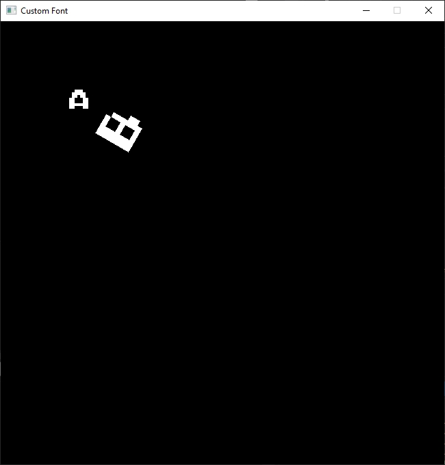

[Last time](/posts/making-custom-fonts-with-sdl/), I went through the process of transforming bits from a series
of bytes to pixels in a texture, making a custom character render on the
screen. Expanding on that, I want to be able to load many characters and
display them separately.

I'll start out by assigning a second character to the font set:

```c
char font8x8[2][8] =
{
    // A
    {
        0b00111000,  
        0b01111100,  
        0b01101100,  
        0b11000110,  
        0b11000110,  
        0b11111110,  
        0b11000110,  
        0b00000000,  
    },
    // B
    {
	  	0b11110000,  
	  	0b11001000,  
	  	0b11001000,  
	  	0b11111000,  
	  	0b11001100,  
	  	0b11001100,  
	  	0b11111000,  
	  	0b00000000,  
    }
}
```

I simplified the `bits_to_pixels` function and made it always have a width
and height of 8. It also prints the characters being loaded:

```c
void bits_to_pixels(
    uint32_t* pixels,
    const char* bits,
    uint8_t r, uint8_t g, uint8_t b)
{
    const size_t BITS_IN_BYTE = 8;

    uint32_t target_color =
        (r << 3 * BITS_IN_BYTE) |
        (g << 2 * BITS_IN_BYTE) |
        (b << 1 * BITS_IN_BYTE);

    for (int row = 0; row < BITS_IN_BYTE; row++)
    {
        for (int col = 0; col < BITS_IN_BYTE; col++)
        {
            uint32_t pixel = 0;
            if ((bits[row] & (1 << (BITS_IN_BYTE - 1 - col))) > 0)
            {
				pixel = target_color | 0xFF;
            }

            pixels[col + row * BITS_IN_BYTE] = pixel;

			printf("%c", pixel > 0 ? '0' : '.');
        }
        printf("\n");
    }
}
```

This next function does the work of assembling the image we want to turn into
a texture. It creates a SDL surface with all the characters from the data
that's passed in. It takes in how many pixels there are per side
(`side_size`), but right now it only processes squared characters, with a
size of 8. My hope is to extend this function to be able to take in
characters with a side size multiple by 8, or some other kind of data layout.
It also takes in an element `count`. Red, green and blue values are just
passed to `bits_to_pixels`.

I ran into an issue that the characters seemed to be loading fine, but they
were being displayed in a weird way. As I was trying to create an horizontal
strip, i.e characters side-by-side, I didn't realize that I was loading the
second row of pixels of the first character as the first row of the second
character, because an entire character is loaded at a time. The easiest
solution was to load it all as a vertical strip, so that the width of the
surface is the width of the character.

After the texture is created, the surface and pixel data are freed.
`SDL_FreeSurface` doesn't free the pixel data from surfaces created with
`SDL_CreateRGBSurfaceFrom` and not handling that could be a source of memory
leaks.

```c
SDL_Texture* data_to_texture(
    SDL_Renderer* rend,
    const char** data,
    unsigned int side_size,
    unsigned int count,
    uint8_t r, uint8_t g, uint8_t b)
{

    Uint32 rmask, gmask, bmask, amask;
#if SDL_BYTEORDER == SDL_BIG_ENDIAN
    rmask = 0xff000000;
    gmask = 0x00ff0000;
    bmask = 0x0000ff00;
    amask = 0x000000ff;
#else
    rmask = 0x000000ff;
    gmask = 0x0000ff00;
    bmask = 0x00ff0000;
    amask = 0xff000000;
#endif

    uint32_t* pixel_data = (uint32_t*)malloc(
        sizeof(*pixel_data) * side_size * side_size * count);

    for (int i = 0; i < count; i++)
    {
        unsigned int elem = i * side_size * side_size;
        bits_to_pixels(&pixel_data[elem], &data[i], r, g, b);
    }

    // Creating a vertical strip surface of the elements.
    // pixel_data holds each row of a character continuously,
    // so vstrip is easier to load
    SDL_Surface* surf = SDL_CreateRGBSurfaceFrom(
        (void*)pixel_data,               // 0xRRGGBBAA for each pixel
        side_size,                       // width
        side_size * count,               // height
        32,                              // depth
        side_size * sizeof(*pixel_data), // pitch (length of a row of pixels in bytes)
        rmask, gmask, bmask, amask);     // color mask

    SDL_Texture* tex = SDL_CreateTextureFromSurface(rend, surf);

    SDL_FreeSurface(surf);
    free(pixel_data);

    return tex;
}
```

So all we need to do now is create a texture and display sections of it as
each character.

Create Texture:
```c
SDL_Texture* tex = data_to_texture(rend, font8x8, 8, 2, 0xFF, 0xFF, 0xFF);
```

Get the source rectangle for each character and display them:
```c
SDL_Rect srect_A = { 0, 0, 8, 8 }; // top of vertical strip
SDL_Rect srect_B = { 0, 8, 8, 8 }; // second element vertical strip

SDL_Rect drect_A = { 100, 100, 32, 32 };
SDL_RenderCopy(rend, tex, &srect_A, &drect_A);

SDL_Rect drect_B = { 150, 120, 64, 64 };
SDL_RenderCopyEx(rend, tex, &srect_B, &drect_B, -60, NULL, SDL_FLIP_NONE);
```

And the characters from the same texture draw separately!



Next step will be to make it all work similarly to `printf`, also providing a
position to draw at, for example: `draw_text("Hello", xpos, ypos)`.